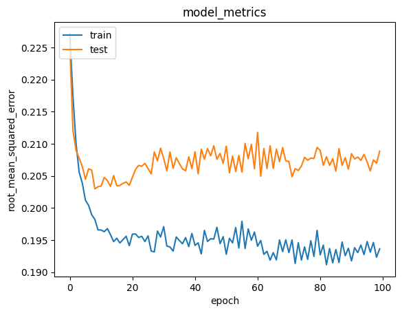

# Laporan Proyek Machine Learning - Tsaqif Mutashim Mufid

## Project Overview

Film adalah salah satu bentuk seni dan hiburan yang banyak disukai di Indonesia. Belakangan ini, minat orang terhadap film semakin meningkat. Ini disebabkan oleh beberapa hal, seperti perkembangan teknologi yang membuat produksi film lebih mudah, pendapatan masyarakat yang meningkat, serta adanya berbagai peristiwa dan acara yang membuat orang semakin tertarik untuk menonton film. Film juga menjadi media efektif untuk menyampaikan pesan dan menggambarkan kehidupan masyarakat [1]. Teknologi modern dan platform streaming seperti Netflix serta Youtube memiliki peran penting dalam pembuatan dan pemasaran film di Indonesia, serta membantu mengembangkan industri film di negara ini [2]. Banyak  atribut  film  dipelajari  seperti  produser,  penulis,  aktor,  aktris,  *genre*, *subtitle*,  dll.  Berdasarkan  studi,  ditemukan  bahwa  atribut  yang  paling  efektif  adalah genre dan kata-kata yang digunakan dalam film. Metodologi yang dipelajari dijelaskan. Sebagian besar sistem rekomendasi online untuk berbagai item menggunakan peringkat dari  pengguna  sebelumnya  untuk  membuat  rekomendasi  kepada  pengguna  saat  ini dengan minat yang sama. Sistem memungkinkan pengguna memasukkan film pencarian yang  lebih  panjang  dan lebih  informatif,  dan  mengumpulkan  peringkat  dari  pengguna saat  hasil  pencarian  menemukan  barang  mereka  perlu  atau  tidak [3]. Selain itu ada beberapa keuntungan menggunakan *Artificial Neural Network* yaitu kemampuannya untuk mempelajari pola yang kompleks dan meningkatkan kinerja sistem rekomendasi dari waktu ke waktu mengembangkan sistem rekomendasi film berbasis konten yang lebih akurat dan relevan dari platform streaming Netflix dan Disney+ dengan menggunakan metode ANN [4]. Oleh karena itu, penggunaan *system* rekomendasi berdasarkan *content-based filtering* dan *collaborative-filtering* dapat membantu pengguna menemukan film yang sesuai dengan preferensi mereka, menciptakan pengalaman menonton yang lebih memuaskan.

**References**:
> [1]	M. B. Ulum, F. Jannah, and F. Nadhiyah, “Film Industry as Part of Global Creative Industry: Learning from Indonesia,” TRLG, vol. 2, no. 3, pp. 220–227, Dec. 2021, doi: 10.33650/trilogi.v2i3.3075.

> [2]	S. Lestari, “The Existence of Youtube Web Series in the Film Industry in Indonesia,” ULTIMA Comm, vol. 14, no. 1, pp. 1–15, Jun. 2022, doi: 10.31937/ultimacomm.v14i1.2232.

> [3]	S. Kondel and N. Singh, “A PAPER ON MOVIE REVIEW BY IMPLEMENTING MOVIE REVIEW APP USING ANDROID TECHNOLOGY,” vol. 6, no. 5, 2019.

> [4]	D. H. Riaji and E. B. Setiawan, “FILM RECOMMENDATION USING CONTENT-BASED USING ARTIFICIAL NEURAL NETWORK METHOD AND ADAM OPTIMIZATION”.

## Business Understanding

Berdasarkan kutipan article pada [3]. Dalam menentukan kualitas film yang berkualitas, ada beberapa preferensi yang berbeda. Namun salah satu faktor yang akan dipilih adalah *genres* dan *rating* film. Dengan memperhatikan *genres* dan *rating* film, pengguna dapat memilih film yang sesuai dengan preferensi mereka, serta dapat menikmati film dengan kualitas yang baik.

### Problem Statements

Dengan pemaparan latar belakang permasalahan diatas, muncul beberapa pertanyaan yang diajukan untuk merumuskan pemahaman lebih mendalam yaitu:
> **Bagaimana cara mengolah dataset film agar dapat digunakan dalam pembuatan model sistem rekomendasi?**


> **Bagaimana sebuah sistem memberikan rekomendasi film kepada pengguna berdasarkan *genres*?**


> **Apakah sistem rekomendasi film dapat memberikan rekomendasi kepada pengguna berdasarkan *rating*?**

### Goals

Untuk menjawab dari permasalahan sebelumnya, penulis mencoba membuat predictive analysis dengan tujuan atau goals sebagai berikut:
> **Memahami cara megolah dataset film untuk digunakan dalam pembuatan model sistem rekomendasi.**

> **Membuat pengguna lebih mudah dalam menentukan film yang tepat dengan bantuan sistem rekomendasi berdasarkan *genre*.**

> **Menghasilkan rekomendasi film yang lebih personal dan akurat dengan melibatkan informasi rating dalam sistem rekomendasi.**

## Solution Approach

Untuk mencapai tujuan serta dapat menyelesaikan dari problem statements diatas, ditentukanlah 2 model filtering yang akan digunakan yaitu content-filtering dan collaborative-filtering.
- Untuk mengolah dataset agar dapat digunakan dalam pembuatan model diperlukan beberapa tahap pre-processing:
1. Mengecek Masalah Data yang Kosong: Melakukan pengecekan untuk mengidentifikasi dan mengatasi nilai yang kosong atau hilang pada dataset film.
2. Menghitung Besar/Panjang Data: Mengetahui jumlah total data dan melihat ukuran dataset untuk memahami seberapa besar dataset yang akan diolah.
3. Menguraikan Jenis Fitur pada Kolom Genre: Menganalisis jenis-jenis fitur dalam kolom genre untuk memahami karakteristik genre film yang ada.
4. Mengurutkan Data movieId dan Menghapus Data yang Sama: Mengurutkan data berdasarkan kolom movieId untuk memudahkan pemrosesan serta Menghapus data duplikat berdasarkan movieId untuk menjaga keunikan setiap entri film.
5. Membuang Judul Film yang Duplikat dengan Metode drop_duplicates(): Menggunakan metode drop_duplicates() untuk menghapus baris yang memiliki judul film yang sama, memastikan setiap judul film bersifat unik.
- Content Based Filtering: Rekomendasi berbasis konten yang merekomendasikan item yang memiliki kemiripan dengan item yang disukai/diinput pengguna sebelumnya. Keuntungan dari Content-Based Filtering melibatkan kemampuannya untuk memberikan rekomendasi yang sesuai dengan preferensi spesifik pengguna. Namun, kelemahannya terletak pada keterbatasannya dalam menemukan item baru atau menangani perubahan preferensi pengguna. Oleh karena itu, seringkali digunakan bersama dengan metode rekomendasi lainnya, seperti Collaborative Filtering, untuk meningkatkan kualitas rekomendasi secara keseluruhan.
- Collaborative Filtering: Rekomendasi ini merupakan sistem yang tidak bergantung pada atribut atau karakteristik item, tetapi lebih fokus pada pola perilaku pengguna dan interaksi antar pengguna. Pada proyek ini dibutuhkan *rating* dari user untuk membaca pola perilaku pengguna yang menghasilkan sejumlah rekomendasi film sesuai dengan preferensi pengguna.

## Data Understanding
Pada sistem rekomendasi film ini menggunakan Dataset yang dikelola oleh GroupLens Research (laboratorium penelitian di University of Minnesota) melalui MovieLens. Dataset ini dapat diakses melalui [MovieLens](https://grouplens.org/datasets/movielens/).

Dikarenakan progress pada proyek ini sifatnya development maka berkas yang dipilih merupakan `ml-latest-small` yang yang di *generate* pada 26 September 2018. Data yang disajikan setelah berkas terunduh lalu mengekstraknya meliputi: 
1. 'Readme.md' 
2. 'links.csv':
  -  movieId: ID unik untuk setiap film.
  -  imdbId: ID unik IMDb (Internet Movie Database) untuk film tersebut.
  -  tmdbId: ID unik TMDb (The Movie Database) untuk film tersebut.
3. 'movies.csv':
  -  movieId: ID unik untuk setiap film.
  -  title: Judul film.
  -  genres: Kategori atau genre film, dapat berisi lebih dari satu genre yang dipisahkan dengan tanda "|".
4. 'ratings.csv':
  - userId: ID unik untuk setiap pengguna.
  - movieId: ID unik untuk setiap film.
  - rating: Nilai penilaian pengguna terhadap film, skala 1 hingga 5.
  - timestamp: Waktu saat penilaian diberikan.
5. 'tags.csv':
  - userId: ID unik untuk setiap pengguna.
  - movieId: ID unik untuk setiap film.
  - tag: Kata kunci atau tag yang diberikan oleh pengguna untuk film tersebut.
  - timestamp: Waktu saat tag ditambahkan. 

Setelah teridentifikasi maka hasil akhir yang bisa didapatkan yaitu memakai 3 berkas yaitu movies.csv, ratings.csv, dan tags.csv. Selanjutnya untuk mendapatkan informasi lebih mendalam terhadap data dilakukan lah beberapa fungsi kode yaitu `.info()`, `.isnull().sum()`, `.duplicated().sum()`. Hasil yang diperoleh untuk berkas movies.csv berisikan 9743 *entries* × 3 kolom, berkas ratings.csv berisikan 100836 *entries* * 4 kolom dan tags.csv berisikan 3683 *entries* * 4 kolom. Dari hasil pengecekan juga diketahui bahwa data tersebut tidak berisikan *null* atau *duplicated*, Selanjutnya terdapat juga data kolom di beberapa berkas yang tidak terpakai nantinya yaitu `timestamp`. Maka karena tidak membutuhkan fitur tersebut maka akan dilakukan pembersihan dengan menggunakan fungsi `.drop(columns=['timestamp'])` pada berkas ratings.csv dan tags.csv. 

Selain itu informasi yang bisa di gali kembali terdapat pada berkas movies.csv yaitu ada berapa banyak variasi pada *genres* dalam dataset tersebut menggunakan melalui code dibawah.

```sh
print('Banyak variasi genres: ', len(movies.genres.unique()))
print('Tipe genres: ', movies.genres.unique())
```
Hasilnya terdapat banyak variasi genres berjumlah 951 dengan variasi genres yang bisa di lihat pada notebook dalam proyek ini.

Setelah semua data telah dianalis dengan baik, langkah selanjutnya adalah melakukan penggabungan berdasarkan `movieId` terhadap movies dan juga ratings. Hasil penggabungan terdapat pada Tabel 1.

|        | movieId | title                                     | genres                                          | userId | rating |
| ------ | ------- | ----------------------------------------- | ----------------------------------------------- | ------ | ------ |
| 0      | 1       | Toy Story (1995)                          | Adventure\|Animation\|Children\|Comedy\|Fantasy | 1.0    | 4.0    |
| 1      | 1       | Toy Story (1995)                          | Adventure\|Animation\|Children\|Comedy\|Fantasy | 5.0    | 4.0    |
| 2      | 1       | Toy Story (1995)                          | Adventure\|Animation\|Children\|Comedy\|Fantasy | 7.0    | 4.5    |
| 3      | 1       | Toy Story (1995)                          | Adventure\|Animation\|Children\|Comedy\|Fantasy | 15.0   | 2.5    |
| 4      | 1       | Toy Story (1995)                          | Adventure\|Animation\|Children\|Comedy\|Fantasy | 17.0   | 4.5    |
| ...    | ...     | ...                                       | ...                                             | ...    | ...    |
| 100849 | 193581  | Black Butler: Book of the Atlantic (2017) | Action\|Animation\|Comedy\|Fantasy              | 184.0  | 4.0    |
| 100850 | 193583  | No Game No Life: Zero (2017)              | Animation\|Comedy\|Fantasy                      | 184.0  | 3.5    |
| 100851 | 193585  | Flint (2017)                              | Drama                                           | 184.0  | 3.5    |
| 100852 | 193587  | Bungo Stray Dogs: Dead Apple (2018)       | Action\|Animation                               | 184.0  | 3.5    |
| 100853 | 193609  | Andrew Dice Clay: Dice Rules (1991)       | Comedy                                          | 331.0  | 4.0    |

Tabel 1. Hasil Penggabungan Movies dan Ratings

## Data Preparation

Untuk melanjutkan kedalam tahap modeling, tentu data yang dipunya harus benar - benar siap. Oleh karena itu, dalam tahap data preparation dataframe yang sudah digabung akan ada pra-pemrosesan lebih lanjut seperti penggabungan menggunakan fungsi concatenate dari *library* numPy. Digunakanya fungsi numpy alasannya dikarenakan untuk mencapai tujuan dimana satu data dengan data lainnya singkron, selain itu terdapat juga pengecekan data apakah terdapat duplicate, solusi yang diberikan terhadap data yang duplicate.

Pertama - tama, data movieId terhadap movies dan tags akan disatu padukan sehingga code yang dimuat sebagai berikut:

```sh
all_movies = np.concatenate((
    movies.movieId.unique(),
    tags.movieId.unique(),
))

# Mengurutkan data dan menghapus data yang sama
all_movies = np.sort(np.unique(all_movies))

print('Jumlah seluruh data film berdasarkan movieId: ', len(all_movies))
```

Setelah dijalankan code tersebut, hasil yang bisa dilihat merupakan jumlah seluruh data film berdasarkan movieId berjumlah 9742. Sedangkan untuk data userId terhadap ratings dan tags mempunyai seluruh data film berjumlah 610 dari code yang dijalankan berikut ini:

```sh
all_users = np.concatenate((
    ratings.userId.unique(),
    tags.userId.unique(),
))

# Mengurutkan data dan menghapus data yang sama
all_users = np.sort(np.unique(all_users))

print('Jumlah seluruh data film berdasarkan userId: ', len(all_users))
```
Setelahnya, data yang sudah ditelusuri dengan baik akan mencoba untuk menggabunggkan kembali dari ketiga variasi dataset tersebut menggunakan fungsi pandas merge. Hasilnya bisa dilihat pada Tabel 2.

| userId_x | movieId | rating_x | title | genres                         | userId_y                                        | tag   | rating_y |     |
| -------- | ------- | -------- | ----- | ------------------------------ | ----------------------------------------------- | ----- | -------- | --- |
| 0        | 1       | 1        | 4.0   | Toy Story (1995)               | Adventure\|Animation\|Children\|Comedy\|Fantasy | NaN   | NaN      | NaN |
| 1        | 1       | 1        | 4.0   | NaN                            | NaN                                             | 336.0 | pixar    | NaN |
| 2        | 1       | 1        | 4.0   | NaN                            | NaN                                             | 474.0 | pixar    | NaN |
| 3        | 1       | 1        | 4.0   | NaN                            | NaN                                             | 567.0 | fun      | NaN |
| 4        | 1       | 1        | 4.0   | NaN                            | NaN                                             | 1.0   | NaN      | 4.0 |
| ...      | ...     | ...      | ...   | ...                            | ...                                             | ...   | ...      | ... |
| 6258744  | 610     | 168252   | 5.0   | NaN                            | NaN                                             | 610.0 | NaN      | 5.0 |
| 6258745  | 610     | 170875   | 3.0   | The Fate of the Furious (2017) | Action\|Crime\|Drama\|Thriller                  | NaN   | NaN      | NaN |
| 6258746  | 610     | 170875   | 3.0   | NaN                            | NaN                                             | 50.0  | NaN      | 1.0 |
| 6258747  | 610     | 170875   | 3.0   | NaN                            | NaN                                             | 249.0 | NaN      | 3.0 |
| 6258748  | 610     | 170875   | 3.0   | NaN                            | NaN                                             | 610.0 | NaN      | 3.0 |

Tabel 2. Penggabungan 3 Dataset

Selanjutnya, untuk dataset yang akan menjadi acuan dalam tahap *solution approach* akan dilakukan penentuan *variable* agar pembacaan data lebih *readable*. all_film_name merupakan variable gabungan antara all_film_rate yang berisikan berkas ratings yang disatupadukan dengan movies 'movieId', 'title', 'genres' berdasarkan 'movieId'. Setelah itu all_film yang merupakan gabungan kembali antara all_film_name dan juga tags 'movieId' serta 'tag' berdasarkan 'movieId'. Sehingga hasil akhir dapat dilihat pada Tabel 3.

| userId | movieId | rating | title | genres                         | tag                                             |                  |
| ------ | ------- | ------ | ----- | ------------------------------ | ----------------------------------------------- | ---------------- |
| 0      | 1       | 1      | 4.0   | Toy Story (1995)               | Adventure\|Animation\|Children\|Comedy\|Fantasy | pixar            |
| 1      | 1       | 1      | 4.0   | Toy Story (1995)               | Adventure\|Animation\|Children\|Comedy\|Fantasy | pixar            |
| 2      | 1       | 1      | 4.0   | Toy Story (1995)               | Adventure\|Animation\|Children\|Comedy\|Fantasy | fun              |
| 3      | 1       | 3      | 4.0   | Grumpier Old Men (1995)        | Comedy\|Romance                                 | moldy            |
| 4      | 1       | 3      | 4.0   | Grumpier Old Men (1995)        | Comedy\|Romance                                 | old              |
| ...    | ...     | ...    | ...   | ...                            | ...                                             | ...              |
| 285757 | 610     | 168252 | 5.0   | Logan (2017)                   | Action\|Sci-Fi                                  | emotional        |
| 285758 | 610     | 168252 | 5.0   | Logan (2017)                   | Action\|Sci-Fi                                  | gritty           |
| 285759 | 610     | 168252 | 5.0   | Logan (2017)                   | Action\|Sci-Fi                                  | heartbreaking    |
| 285760 | 610     | 168252 | 5.0   | Logan (2017)                   | Action\|Sci-Fi                                  | predictible plot |
| 285761 | 610     | 170875 | 3.0   | The Fate of the Furious (2017) | Action\|Crime\|Drama\|Thriller                  | NaN              |

Tabel 3. all_film

Setelah dibentuknya dataframe sesuai Tabel 3. Saatnya pengecekan kembali agar data yang akan masuk dalam tahap modeling benar - benar bersih, seperti biasa akan dilakukan cek *duplicate*  atau pun *null* jika terdapat *duplicate* maupun *null* maka nantinya akan diatasi dengan cara pembersihan sesuai dengan data yang dibutuhkan. Cek data apakah *null* bisa dilihat pada potongan kode dibawah:

```zsh
all_film.isnull().sum()
```
Hasil yang diberikan terdapat data yang *null* pada tag berjumlah 52549. Karena yang lainnya tidak menunjukkan bahwa data tersebut *null*, maka solusi yang dapat diberikan yaitu menggunakan fungsi dari pandas yaitu `.drop`. Sehingga hasil akhir yang didefinisikan oleh variable all_film_clean bisa lanjut kedalam tahap cek duplikasi. Sebelum cek *duplicate* mari telusuri berapa jumlah data sebelum dan setelah hasil cek *duplicate* melalui pemanggilan fungsi `.shape` dan `len(fix_film.movieId.unique())`. Setelah itu mari kita coba urutkan agar terlihat jelas menggunakan `.sort_values('movieId')`. Hasil yang diberikan terdapat (233213, 6) dan movieId yang unique berjumlah 1554. MovieId ini yang nantinya akan dijadikan acuan apakah data kita terdapat film yang terindikasi *duplicate*. Setelah diketahui dari penyortiran hasil yang didapat ternyata masih banyak data yang *duplicate*, maka dari itu potongan kode berikut akan dijalankan:

```zsh
fix_film.drop_duplicates('movieId')
```

Maka dataset yang telah diseleksi dengan cermat sudah jadi. Hasil dari beberapa proses yang dilakukan bisa dilihat pada Tabel 4.

|        | userId | movieId | rating | title                              | genres                                          | tag             |
| ------ | ------ | ------- | ------ | ---------------------------------- | ----------------------------------------------- | --------------- |
| 0      | 1      | 1       | 4.0    | Toy Story (1995)                   | Adventure\|Animation\|Children\|Comedy\|Fantasy | pixar           |
| 187260 | 414    | 2       | 3.0    | Jumanji (1995)                     | Adventure\|Children\|Fantasy                    | fantasy         |
| 106951 | 240    | 3       | 4.0    | Grumpier Old Men (1995)            | Comedy\|Romance                                 | old             |
| 19921  | 45     | 5       | 3.0    | Father of the Bride Part II (1995) | Comedy                                          | pregnancy       |
| 115692 | 262    | 7       | 3.0    | Sabrina (1995)                     | Comedy\|Romance                                 | remake          |
| ...    | ...    | ...     | ...    | ...                                | ...                                             | ...             |
| 27632  | 62     | 183611  | 4.0    | Game Night (2018)                  | Action\|Comedy\|Crime\|Horror                   | Comedy          |
| 174264 | 380    | 184471  | 3.0    | Tomb Raider (2018)                 | Action\|Adventure\|Fantasy                      | Alicia Vikander |
| 44721  | 98     | 187593  | 5.0    | Deadpool 2 (2018)                  | Action\|Comedy\|Sci-Fi                          | sarcasm         |
| 263643 | 586    | 187595  | 5.0    | Solo: A Star Wars Story (2018)     | Action\|Adventure\|Children\|Sci-Fi             | Emilia Clarke   |
| 81531  | 184    | 193565  | 3.5    | Gintama: The Movie (2010)          | Action\|Animation\|Comedy\|Sci-Fi               | anime           |

Tabel 4. Fix Dataset

Selanjutnya dataset yang telah siap, akan memasuki tahap proses perubahan menjadi list agar bisa disesuaikan dengan *Solution Approach* menggunakan fungsi `preparation['{}'].tolist()` dimana {} berisikan 'movieId', 'title', 'genres', dan 'tag'.

## Modeling

Modeling ini salah satu yang cukup perlu dapat perhatian dikarenakan *Solutions Approach* yang didefinisikan di awal menggunakan *content-filtering* dan juga *collaborative-filtering* erat kaitannya dengan dataset yang sudah dipersiapkan.

### *Content-Filtering*

Hal yang pertama dilakukan adalah membuat dataset sebelumnya menjadi *dictionary*, karena sebelumnya sudah dikonversi menjadi list maka dengan itu hanya memerlukan sedikit penyesuaian menjadi *dictionary* setelah itu dilanjutkan ke dalam tahap modeling menggunakan metode `TfidfVectorizer` atau TF-IDF. Metode TF-IDF digunakan untuk mengubah data teks menjadi vektor numerik, Algoritma TF-IDF melakukan pemberian bobot pada setiap kata kunci disetiap kategori untuk mencari kemiripan kata kunci dengan kategori yang tersedia. Pada kasus ini kata kunci berdasarkan 'genres' yang akan dipilih sehingga hasil keluaran yang didapatkan akan seperti berikut:

```zsh
array(['action', 'adventure', 'animation', 'children', 'comedy', 'crime',
       'documentary', 'drama', 'fantasy', 'fi', 'film', 'genres',
       'horror', 'imax', 'listed', 'musical', 'mystery', 'no', 'noir',
       'romance', 'sci', 'thriller', 'war', 'western'], dtype=object)
```
Selanjutnya setelah dilakukan pembobotan hasil yang bisa diketahui adalah (1554, 24). Dimana 1554 mengindikasikkan movies dan 24 masuk kedalam kategori 'genres', nantinya hasil yang akan dicapai yaitu TF-IDF dalam bentuk konversi menjadi `.todense()`. Berikut hasil penggabungan dataframe dengan TF-IDF bisa dilihat pada Tabel 5.

| title                                  | no  | horror   | adventure | imax | genres | musical | documentary | animation | listed | children | ... | noir | fi      | thriller | film | fantasy  | mystery  | romance  | drama    | sci     | action   |
| -------------------------------------- | --- | -------- | --------- | ---- | ------ | ------- | ----------- | --------- | ------ | -------- | --- | ---- | ------- | -------- | ---- | -------- | -------- | -------- | -------- | ------- | -------- |
|                                        |     |          |           |      |        |         |             |           |        |          |     |      |         |          |      |          |          |          |          |         |          |
| Paddington (2014)                      | 0.0 | 0.000000 | 0.000000  | 0.0  | 0.0    | 0.0     | 0.0         | 0.000000  | 0.0    | 0.875445 | ... | 0.0  | 0.00000 | 0.000000 | 0.0  | 0.000000 | 0.000000 | 0.000000 | 0.000000 | 0.00000 | 0.000000 |
| Wall Street (1987)                     | 0.0 | 0.000000 | 0.000000  | 0.0  | 0.0    | 0.0     | 0.0         | 0.000000  | 0.0    | 0.000000 | ... | 0.0  | 0.00000 | 0.000000 | 0.0  | 0.000000 | 0.000000 | 0.000000 | 1.000000 | 0.00000 | 0.000000 |
| Akira (1988)                           | 0.0 | 0.000000 | 0.405316  | 0.0  | 0.0    | 0.0     | 0.0         | 0.531654  | 0.0    | 0.000000 | ... | 0.0  | 0.44606 | 0.000000 | 0.0  | 0.000000 | 0.000000 | 0.000000 | 0.000000 | 0.44606 | 0.393858 |
| Fish Called Wanda, A (1988)            | 0.0 | 0.000000 | 0.000000  | 0.0  | 0.0    | 0.0     | 0.0         | 0.000000  | 0.0    | 0.000000 | ... | 0.0  | 0.00000 | 0.000000 | 0.0  | 0.000000 | 0.000000 | 0.000000 | 0.000000 | 0.00000 | 0.000000 |
| Dead Again (1991)                      | 0.0 | 0.000000 | 0.000000  | 0.0  | 0.0    | 0.0     | 0.0         | 0.000000  | 0.0    | 0.000000 | ... | 0.0  | 0.00000 | 0.529096 | 0.0  | 0.000000 | 0.687161 | 0.497863 | 0.000000 | 0.00000 | 0.000000 |
| Lady in the Water (2006)               | 0.0 | 0.000000 | 0.000000  | 0.0  | 0.0    | 0.0     | 0.0         | 0.000000  | 0.0    | 0.000000 | ... | 0.0  | 0.00000 | 0.000000 | 0.0  | 0.683058 | 0.664780 | 0.000000 | 0.302488 | 0.00000 | 0.000000 |
| Jaws 3-D (1983)                        | 0.0 | 0.799338 | 0.000000  | 0.0  | 0.0    | 0.0     | 0.0         | 0.000000  | 0.0    | 0.000000 | ... | 0.0  | 0.00000 | 0.000000 | 0.0  | 0.000000 | 0.000000 | 0.000000 | 0.000000 | 0.00000 | 0.600882 |
| One Flew Over the Cuckoo's Nest (1975) | 0.0 | 0.000000 | 0.000000  | 0.0  | 0.0    | 0.0     | 0.0         | 0.000000  | 0.0    | 0.000000 | ... | 0.0  | 0.00000 | 0.000000 | 0.0  | 0.000000 | 0.000000 | 0.000000 | 1.000000 | 0.00000 | 0.000000 |
| What If (2013)                         | 0.0 | 0.000000 | 0.000000  | 0.0  | 0.0    | 0.0     | 0.0         | 0.000000  | 0.0    | 0.000000 | ... | 0.0  | 0.00000 | 0.000000 | 0.0  | 0.000000 | 0.000000 | 0.690993 | 0.433964 | 0.00000 | 0.000000 |
| Limelight (1952)                       | 0.0 | 0.000000 | 0.000000  | 0.0  | 0.0    | 0.0     | 0.0         | 0.000000  | 0.0    | 0.000000 | ... | 0.0  | 0.00000 | 0.000000 | 0.0  | 0.000000 | 0.000000 | 0.690993 | 0.433964 | 0.00000 | 0.000000 |

Tabel 5. Hasil Penggabungan Dataframe dengan TF-IDF

Berdasarkan hasil tabel 5, output matriks TF-iDF menunjukkan film Wall Street (1987) dan One Flew Over the Cuckoo's Nest (1975) memiliki label *genre* yang sama yaitu Drama begitupun film lainnya akan mengikuti kecocokkan *genres* dalam film tersebut.

Setelah kita mengetahui bahwa representasi fitur penting telah menunjukkan korelasinya terhadap *genres*, langkah selanjutnya adalah menghitung derajat kesamaan dengan teknik *cosine_similarity* dari library scikit-learn. Proses perhitungan menggunakan teknik *cosine_similarity* diperoleh dari TF-IDF matrix pada sebelumnya sehingga hasil akhir yang didapatkan berupa matriks kesamaan. Sebagai contoh bisa dilihat pada Tabel 6 setelah dilakukan langkah menghitung derajat kesamaan.

| title                                            | Bachelor and the Bobby-Soxer, The (1947) | Grown Ups 2 (2013) | Henry V (1989) | Yankee Doodle Dandy (1942) | Commitments, The (1991) |
| ------------------------------------------------ | ---------------------------------------- | ------------------ | -------------- | -------------------------- | ----------------------- |
| title                                            |                                          |                    |                |                            |                         |
| Frank (2014)                                     | 0.483077                                 | 0.483077           | 0.099321       | 0.135765                   | 0.337096                |
| Sabrina (1995)                                   | 0.641674                                 | 0.641674           | 0.334487       | 0.000000                   | 0.286387                |
| Talk of the Town, The (1942)                     | 0.497380                                 | 0.497380           | 0.259271       | 0.000000                   | 0.221987                |
| Hope and Glory (1987)                            | 0.000000                                 | 0.000000           | 0.273890       | 0.374389                   | 0.335032                |
| That Thing You Do! (1996)                        | 0.799743                                 | 0.799743           | 0.164428       | 0.224762                   | 0.558069                |
| Broadcast News (1987)                            | 0.578103                                 | 0.578103           | 0.420208       | 0.162471                   | 0.403407                |
| Official Story, The (La historia oficial) (1985) | 0.000000                                 | 0.000000           | 0.273890       | 0.374389                   | 0.335032                |
| More (1998)                                      | 0.000000                                 | 0.000000           | 0.054352       | 0.074296                   | 0.066486                |
| Mean Creek (2004)                                | 0.000000                                 | 0.000000           | 0.139344       | 0.190474                   | 0.170451                |
| Impostors, The (1998)                            | 1.000000                                 | 1.000000           | 0.000000       | 0.000000                   | 0.446312                |

Tabel 6. Hasil Menggunakan Teknik Cosine Similarity

Berdasarkan Tabel 6. Film Impostors, The (1998) mempunyai kemiripan genres dengan Bachelor and the Bobby-Soxer, The (1947) dan Grown Ups 2 (2013). Selanjutnya masuk kedalam tahap modeling yaitu rekomendasi film menggunakan content-filtering. Kode yang dibuat untuk membuat rekomendasi bisa dilihat pada notebook ini namun akan dipersingkat melalui pemanggilan kode yang bisa dilihat dibawah ini tetapi sebelumnya kita harus memeriksa terlebih dahulu film yang akan diuji yaitu 'Deadpool 2 (2018)'. Terlihat bahwa data yang disajikan memuat *genres* Action|Comedy|Sci-Fi. Hal ini lah yang akan dijadikan acuan untuk menghasilkan beberapa rekomendasi yang mirip, setelah ini akan diperlihatkan beberapa rekomendasi yang mirip dengan film 'Deadpool 2 (2018)' melalui pemanggilan kode yang bisa dilihat di bawah ini:

```zsh
content_based_filtering('Deadpool 2 (2018)')
```

Hasil pemanggilan tersebut bisa dilihat pada Tabel 7.

|     | title                                             | genres                 |
| --- | ------------------------------------------------- | ---------------------- |
| 0   | Men in Black (a.k.a. MIB) (1997)                  | Action\|Comedy\|Sci-Fi |
| 1   | Ghostbusters (a.k.a. Ghost Busters) (1984)        | Action\|Comedy\|Sci-Fi |
| 2   | Men in Black II (a.k.a. MIIB) (a.k.a. MIB 2) (... | Action\|Comedy\|Sci-Fi |
| 3   | Terminator 2: Judgment Day (1991)                 | Action\|Sci-Fi         |
| 4   | Logan (2017)                                      | Action\|Sci-Fi         |

Hasil yang dapat dilihat pada Tabel 7, rekomendasi film yang diberikan oleh 'content_based_filtering' terdapat semua genre action yang pertama diikuti Sci-fi, lalu Comedy. Dengan ini sistem rekomendasi berdasarkan 'content_based_filtering' telah berhasil dibuat.

### *collaborative-filtering*

Pada *collaborative-filtering* yang akan digunakan nantinya sebagai bahan dasar sistem rekomendasi yaitu 'ratings' dan 'user'. Langkah selanjutnya adalah melakukan proses *encoding* yaitu mengubah data kategorikal menjadi numerik agar dapat diolah oleh model nantinya, proses ini melibatkan 'user' dan 'movie'. Dari proses tersebut menghasilkan *list encoded* sesuai dengan kategori yang dikonversi, setelah itu dari list tersebut di *mapping* kedalam dataframe namun sebelum itu kita bisa mengetahui sebaran data setelah encoding yaitu terdapat jumlah User sebanyak 610, jumlah film sebanyak 9724, Rating terendah ada di angkka 0.5 dan tertinggi 5.0. Setelah semua di telusuri dengan baik, akan dilakukan pengacakkan dataset agar distribusi datanya menjadi random sebelum memasuki ke dalam tahap modeling.

```zsh
# Membuat variabel x untuk mencocokkan data user dan movie menjadi satu value
x = df_colabol[['user', 'movie']].values

# Membuat variabel y untuk membuat rating dari hasil
y = df_colabol['rating'].apply(lambda x: (x - min_rating) /
                       (max_rating - min_rating)).values
```

Dari potongan kode diatas dapat di ketahui X sebagai fitur penting, dan Y sebagai target dimana ratings sebagai representasi variabel independennya. Selanjutnya potongan dibawah akan menjelaskan bagaimana untuk melatih model berdasarkan X dan Y yang sebelumnya dibuat.

```zsh
# Membagi menjadi 80% data train dan 20% data validasi
train_indices = int(0.8 * df_colabol.shape[0])
x_train, x_val, y_train, y_val = (
    x[:train_indices],
    x[train_indices:],
    y[:train_indices],
    y[train_indices:]
)
```
Potongan kode diatas membagi data train dan validasi dengan komposisi 80:20. Selanjutnya kita masuk kedalam model sistem rekomendasi berbasis *colaborative-filtering*. Potongan kode model sebagai berikut:

```zsh
class RecommenderNet(tf.keras.Model):

  # Insialisasi fungsi
  def __init__(self, num_users, num_film, embedding_size, **kwargs):
    super(RecommenderNet, self).__init__(**kwargs)
    self.num_users = num_users
    self.num_film = num_film
    self.embedding_size = embedding_size
    self.user_embedding = layers.Embedding(  # layer embedding user
        num_users,
        embedding_size,
        embeddings_initializer='he_normal',
        embeddings_regularizer=keras.regularizers.l2(1e-6)
    )
    self.user_bias = layers.Embedding(
        num_users, 1)  # layer embedding user bias
    self.film_embedding = layers.Embedding(  # layer embeddings film
        num_film,
        embedding_size,
        embeddings_initializer='he_normal',
        embeddings_regularizer=keras.regularizers.l2(1e-6)
    )
    self.film_bias = layers.Embedding(
        num_film, 1)  # layer embedding movie bias

  def call(self, inputs):
    user_vector = self.user_embedding(
        inputs[:, 0])  # memanggil layer embedding 1
    user_bias = self.user_bias(inputs[:, 0])  # memanggil layer embedding 2
    film_vector = self.film_embedding(
        inputs[:, 1])  # memanggil layer embedding 3
    film_bias = self.film_bias(inputs[:, 1])  # memanggil layer embedding 4

    dot_user_film = tf.tensordot(user_vector, film_vector, 2)

    x = dot_user_film + user_bias + film_bias

    return tf.nn.sigmoid(x)  # activation sigmoid
```

Setelah itu masuk ke dalam training data dengan konfigurasi `loss=tf.keras.losses.BinaryCrossentropy()`, `optimizer=keras.optimizers.Adam(learning_rate=0.001)` dan `metrics=[tf.keras.metrics.RootMeanSquaredError()]`. Setelah itu model akan melakukan proses training dengan *batch_size*=64 dan epoch sebanyak 100.

```zsh
Epoch 100/100
1261/1261 [==============================] - 11s 9ms/step - loss: 0.6037 - root_mean_squared_error: 0.1936 - val_loss: 0.6221 - val_root_mean_squared_error: 0.2088
```
Hasil yang diperoleh ketika training adalah nilai error akhir sebesar sekitar 0.19 dan error pada data validasi sebesar 0.20. Hal ini juga bisa dilihat pada Gambar 1 mengenai visualisasi model ketika proses training.

Gambar 1. Visualisasi Model

Setelah itu mari kita coba untuk melakukan apakah sistem rekomendasi yang dibuat telah bisa terpenuhi sesuai dengan problem yang diberikan di awal. Proses rekomendasi akan mengambil random sample user dan akan memberikan hasil rekomendasi berdasarkan user tersebut sebanyak 10 film diambil dari tontontonan dari user sebanyak 5 film. Hasil yang diberikan bisa dilihat dibawah ini:

```zsh
49/49 [==============================] - 0s 1ms/step
Showing recommendations for users: 474
===========================
Film with high ratings from user
--------------------------------
Enchanted April (1992) : Drama|Romance
Strictly Ballroom (1992) : Comedy|Romance
Moonstruck (1987) : Comedy|Romance
Safety Last! (1923) : Action|Comedy|Romance
Harry Potter and the Goblet of Fire (2005) : Adventure|Fantasy|Thriller|IMAX
--------------------------------
Top 10 film recommendation
--------------------------------
Paths of Glory (1957) : Drama|War
Last Days of Disco, The (1998) : Comedy|Drama
Two Family House (2000) : Drama
Hope and Glory (1987) : Drama
Midnight Clear, A (1992) : Drama|War
Woman Under the Influence, A (1974) : Drama
Adam's Rib (1949) : Comedy|Romance
Safety Last! (1923) : Action|Comedy|Romance
Reefer Madness: The Movie Musical (2005) : Comedy|Drama|Musical
Paterson : (no genres listed)
```

Model mampu memberikan rekomendasi variasi film sesuai dengan kebutuhan user. 

## Evaluation

Pada tahap evaluasi akan digunakan dua matriks perhitungan evaluasi yang berbeda yaitu akurasi dan RMSE (Root Mean Squared Error). Penjelasan mengenai evaluasi akurasi yang dipakai pada *content-filtering* bisa dilihat dibawah ini.

Pada *content-filtering* sistem memberikan rekomendasi hampir sama dengan *genres* yang dipilih oleh user berdasarkan filmnya sebelumnya yaitu Action|Comedy|Sci-Fi maka dari itu nilai akurasi yang diperoleh adalah 5/5 = 1 * 100% = 100% dimana tingkat akurasi pada *content-filtering* sudah sangat baik. Sedangkan pada *Collaborative-Filtering* akan menggunakan nilai metriks dari RMSE yang dapat diketahui pada Gambar 1, hasil yang diberikan sudah cukup bagus mengingat ini merupakan sebuah metode pengukuran dengan mengukur perbedaan nilai prediksi sebuah model sebagai estimasi nilai yang di observasi. Dengan itu kesimpulan yang dapat diberikan jika nilai RMSE semakin kecil nilai errornya maka semakin bagus prediksinya, berkebalikan dengan nilai error yang besar maka bisa ditarik kesimpulan prediksi yang diberikan kurang bagus atau kurang akurat.